# SAAS Smart Shipment Tracking - Client Side

A localized Next.js web application for the SAAS Smart Shipment Tracking platform. This client app includes the public landing experience, company registration flow, authentication, role-based dashboards, and the public shipment tracking page used by end customers.

## Overview

SAAS Smart Shipment Tracking helps logistics and shipping companies manage their daily operations from one place. The web client supports company onboarding, subscriptions, shipments, clients, routes, users, notes, settings, and real-time shipment visibility.

The client side is built around four main user experiences:

- `admin`: Platform administrator who manages companies, subscription plans, subscription requests, and platform-wide notes.
- `manager`: Company manager who manages the company workspace, shipments, clients, routes, users, subscription, notes, and settings.
- `employee`: Company staff member with access to operational areas such as shipments, clients, routes, notes, statistics, and settings.
- `client`: End customer who does not access the dashboard and only views a public shipment tracking page through a dedicated link.

The codebase also defines a `driver` role for the broader platform, but the current web dashboard does not expose sidebar navigation for drivers.

## Tech Stack

- Next.js 16 with App Router
- React 19
- TypeScript
- Tailwind CSS
- next-intl for localization and locale-aware routing
- TanStack React Query for server-state management
- Axios for API requests
- Socket.IO for real-time updates
- React Hook Form and Zod for forms and validation
- Recharts for dashboard charts
- Leaflet and MapLibre for shipment maps
- next-themes for theme handling
- Sonner for toast notifications

## Getting Started

Install dependencies and start the development server from the `client-side` directory:

```bash
cd "D:/pro/Full Stack Website/SAAS SMART SHIPMENT TRACKING/client-side"
npm install
npm run dev
```

Open the app at:

```bash
http://localhost:3000/ar
```

You can replace `ar` with any supported locale, such as `en`.

## Environment Variables

Create a local environment file and provide the required values:

```env
NEXT_PUBLIC_BASE_URL=
NEXT_PUBLIC_SECRET_KEY=
NEXT_PUBLIC_SOCKET_URL=
```

`NEXT_PUBLIC_BASE_URL` is used as the backend base URL and is extended with `/api/v1`.

`NEXT_PUBLIC_SOCKET_URL` is used by Socket.IO for real-time updates.

`NEXT_PUBLIC_SECRET_KEY` is required by the client configuration and user-token helpers.

## Scripts

```bash
npm run dev
npm run build
npm run start
npm run lint
```

## Localization

The app uses `next-intl` for translations and locale-aware navigation.

Translation files live in:

```text
messages/
```

Supported locales:

```text
en, ar, zh, hi, es, fr, bn, pt, ru, ur
```

Routing configuration:

```text
i18n/routing.ts
```

All pages are scoped by locale:

```text
/{locale}
```

Examples:

```text
/ar/statistics
/en/login
```

Arabic and Urdu render in RTL mode through `app/[locale]/layout.tsx`.

## Project Structure

```text
app/
  [locale]/
    (landing)/       Public landing pages and company registration
    (auth)/          Login flow
    (dashboard)/     Role-based admin, manager, and employee dashboards
    (client)/        Public shipment tracking page

components/
  landing/           Landing and company registration components
  dashboard/         Dashboard headers, actions, and summary components
  sideBar/           Role-based dashboard sidebar
  ui/                Shared UI primitives

lib/
  axios/             Axios setup
  Constant/          Roles, enums, and API route constants
  socket-provider    Socket.IO provider
  react-query        React Query provider

i18n/
  navigation.ts      Locale-aware links and navigation helpers
  request.ts         Message loading
  routing.ts         Supported locale configuration
```

## Routing and Access Control

Route protection is handled in `proxy.tsx` and the middleware files under `middleware/`.

Route groups:

- Public routes: `/`, `/login`
- Admin routes: `/company`, `/subscription`, `/subscription-request`
- Manager-only routes: `/my-subscription`, `/users`
- Manager and employee routes: `/shipments`, `/clients`, `/ways`
- Admin, manager, and employee shared routes: `/statistics`, `/notes`, `/settings`

Company subscription status also affects access:

- `pending`: redirects the user to `/pending`
- `expired`: redirects the user to `/expire`
- `inactive`: redirects the user to `/in-active`

## Public Landing Experience

### Home Page

Route:

```text
/{locale}
```

The landing page introduces the platform and highlights the major product areas:

- Hero section for the smart shipment management platform.
- Feature cards for shipment management, smart tracking, and client management.
- Services section for shipment tracking, clients, routes, drivers, notifications, and feedback.
- Platform preview section with real dashboard screenshots.
- Value proposition section explaining why companies should use the system.
- Driver mobile app showcase.
- Image carousel for operational features.
- FAQ section.
- Final call-to-action banner.

Suggested screenshot:

```md

```

### Company Registration Page

Route:

```text
/{locale}/register-company
```

This page allows a company to submit a new subscription request. The form collects:

- Company name.
- Company location.
- Subscription plan.
- Company email.
- Password and password confirmation.
- Payment receipt image.

The form is submitted as `FormData` through `requestSubscriptionCompany`.

Suggested screenshot:

```md
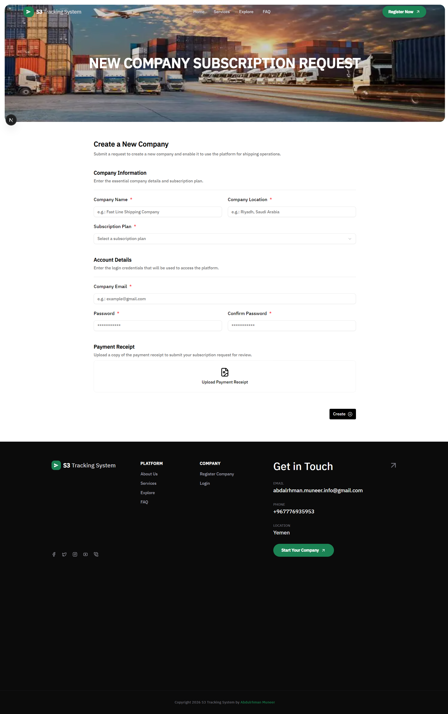
```

## Authentication

### Login Page

Route:

```text
/{locale}/login
```

The login page authenticates dashboard users using email and password. Authenticated users who open the login page are redirected to `/statistics`.

Suggested screenshot:

```md
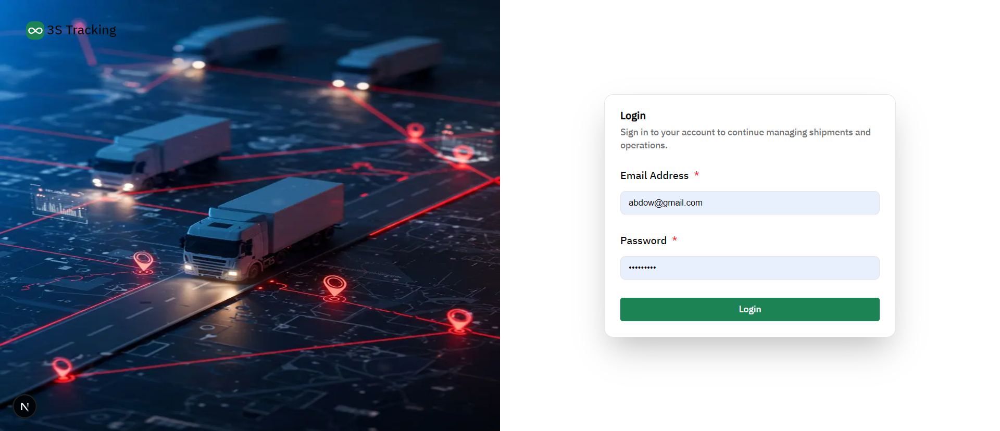
```

## Admin Dashboard

The admin is the platform owner role. The admin sidebar includes:

- Home
- Companies
- Subscriptions
- Subscription requests
- Notes
- Settings

### Admin Statistics

Route:

```text
/{locale}/statistics
```

The admin statistics page provides a platform-level overview:

- Total companies.
- Subscription requests.
- Visitor count.
- Notes count.
- Companies close to subscription expiry.
- Paused companies.
- Company activity chart by month.

The page listens for real-time updates through Socket.IO.

Suggested screenshot:

```md
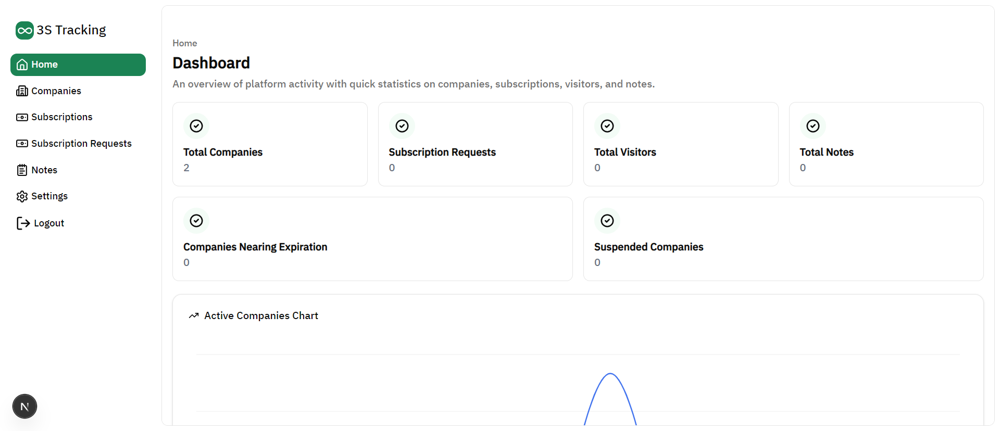
```

### Companies

Route:

```text
/{locale}/company
```

The companies page lists registered companies with search, filtering, pagination, and management actions. Admins can:

- Add a company.
- Edit company data.
- Delete a company.
- Open a company details page.
- Review subscription status.

Suggested screenshot:

```md
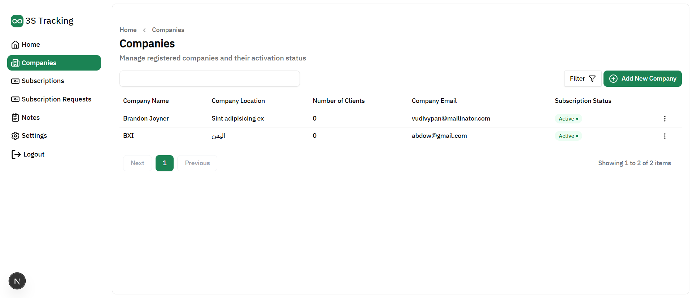
```

### Company Details

Route:

```text
/{locale}/company/{id}
```

The company details page displays a single company profile:

- Basic company information.
- Subscription information.
- Client count.
- Subscription status.

Admins can pause or activate the company subscription from the page header actions.

Suggested screenshot:

```md
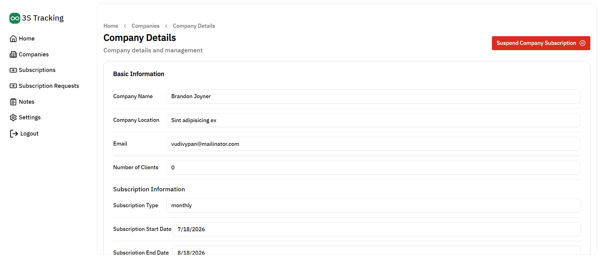
```

### Subscription Plans

Route:

```text
/{locale}/subscription
```

This page manages the subscription plans available to companies. Admins can:

- Add a subscription plan.
- Edit a plan.
- Delete a plan when it is not attached to a company.
- Configure plan price and duration in months.

Suggested screenshot:

```md
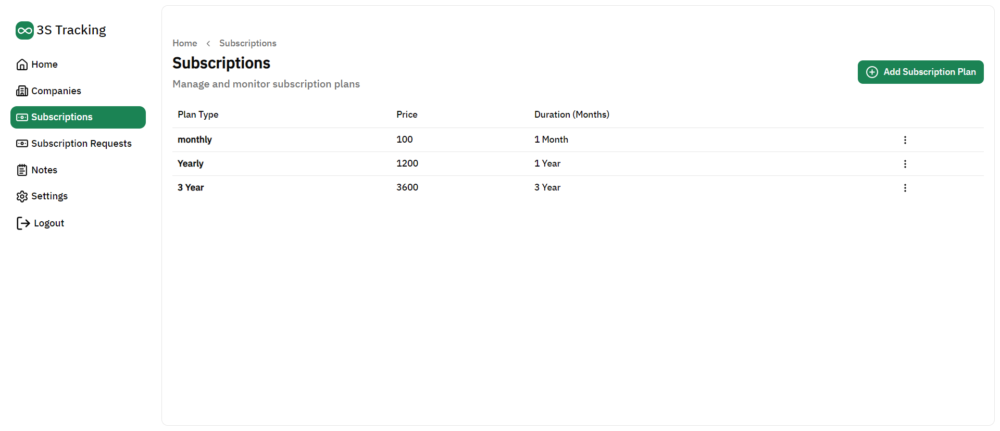
```

### Subscription Requests

Route:

```text
/{locale}/subscription-request
```

This page handles new company subscription requests and plan-change requests. It includes:

- Pending request summary.
- Change-plan request count.
- Total request count.
- Company request cards with requested plan, price, and duration.
- Actions to view the company or approve and activate the request.

Suggested screenshot:

```md
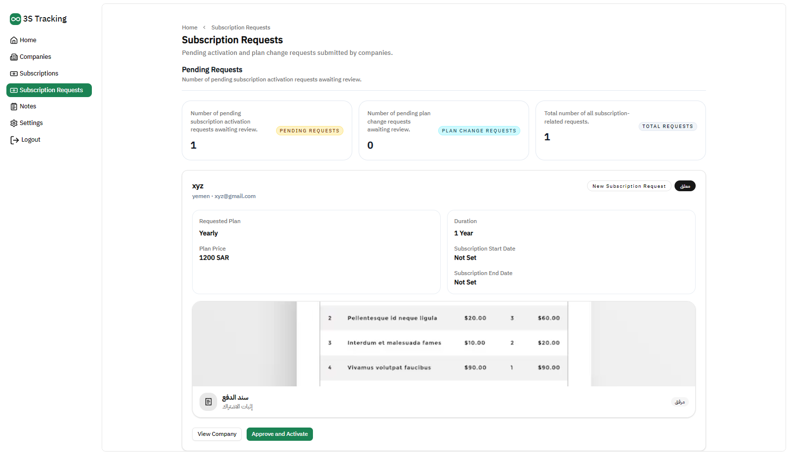
```

### Admin Notes

Route:

```text
/{locale}/notes
```

For admins, the notes page displays notes sent by companies to the platform administration. Admins can review note type, creation date, and message content.

Suggested screenshot:

```md
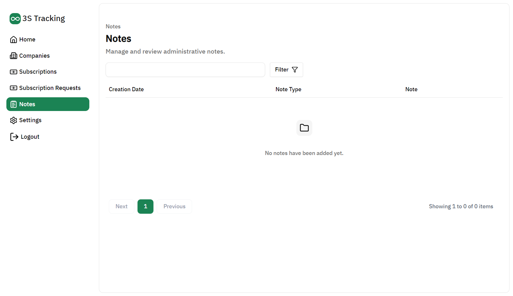
```

## Company Manager Dashboard

The manager controls a company workspace. The manager sidebar includes:

- Home
- Shipments
- Clients
- Routes
- Users
- My subscription
- Notes
- Settings

Some items can be locked when the company subscription is expired or inactive. The subscription page remains available so the manager can review or renew the plan.

### Manager Statistics

Route:

```text
/{locale}/statistics
```

The manager statistics page focuses on company operations:

- Total shipments.
- Current shipments.
- Finished shipments.
- Clients.
- Routes.
- Current shipments table with pagination.

Suggested screenshot:

```md
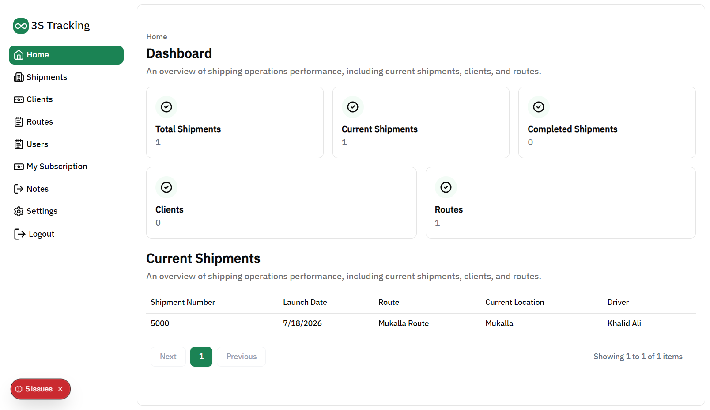
```

### Shipments

Route:

```text
/{locale}/shipments
```

The shipments page is split into:

- Current shipments.
- Finished shipments.

Managers and employees can manage shipment workflows from this page. Supported actions include:

- Create a shipment.
- Assign a route.
- Assign a driver.
- Set launch date.
- Pause a shipment.
- Resume a shipment.
- Finish a shipment.
- Delete a shipment.

Suggested screenshot:

```md
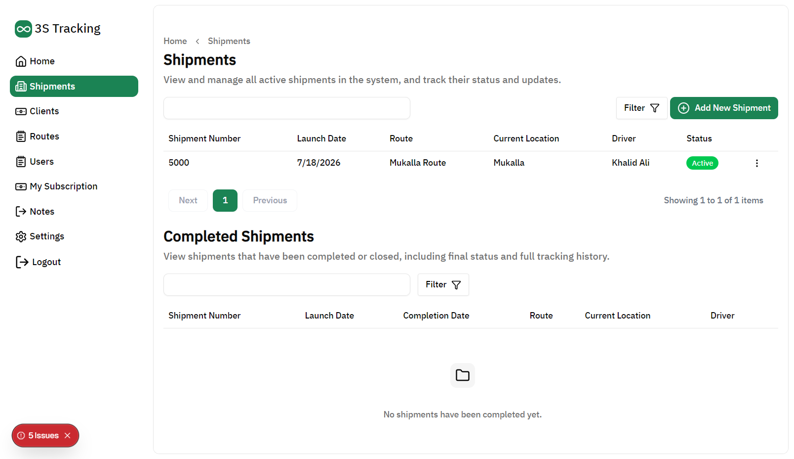
```

### Shipment Details

Route:

```text
/{locale}/shipments/{id}
```

The shipment details page displays a full operational view of one shipment:

- Shipment summary.
- Driver information.
- Route information.
- Origin and destination.
- Current point.
- Clients and shipment items table.
- Add, edit, and delete shipment items.

Suggested screenshot:

```md
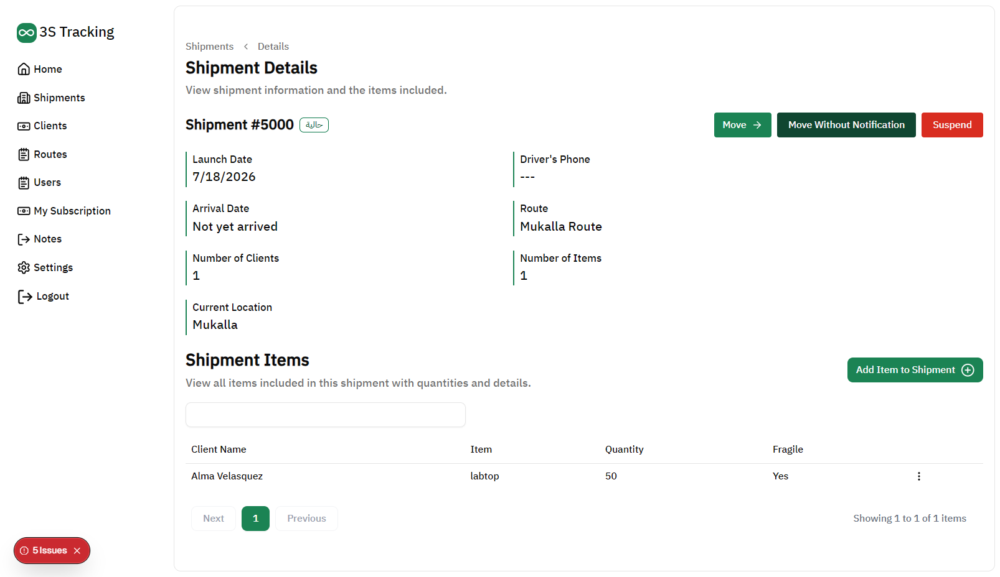
```

### Clients

Route:

```text
/{locale}/clients
```

The clients page manages company clients. Managers and employees can:

- Add a client.
- Edit client data.
- Delete a client.
- View client details.
- Manage contact methods such as phone and email.
- Mark a contact method as primary.

Suggested screenshot:

```md
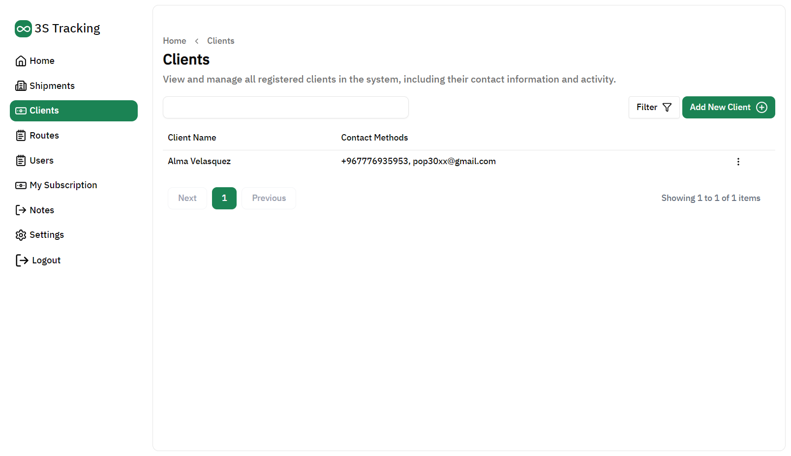
```

### Routes

Route:

```text
/{locale}/ways
```

Routes define the movement path for shipments. Managers and employees can:

- Add a route.
- Define ordered route points.
- Enable map-based point selection.
- Edit route details.
- Delete a route.

Suggested screenshot:

```md
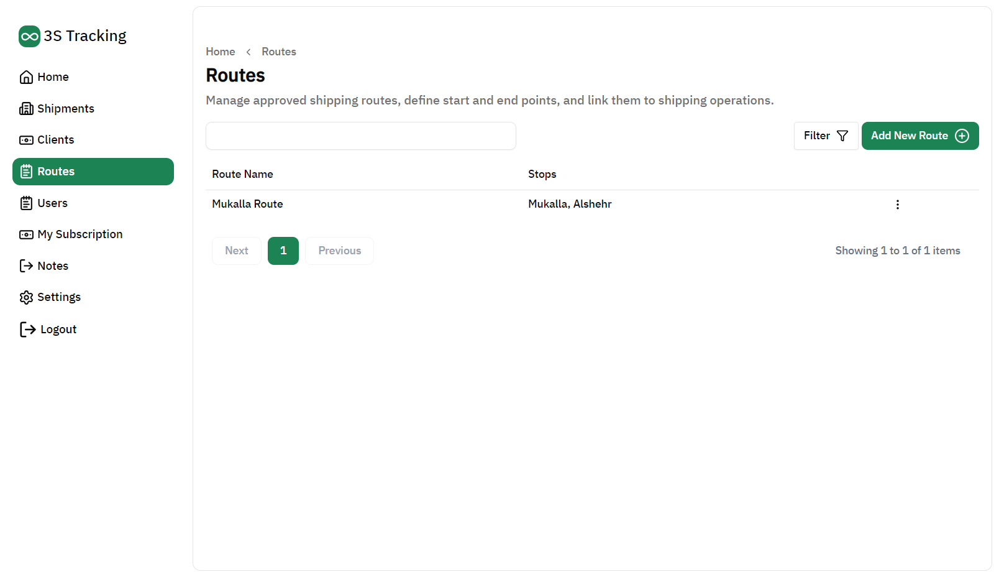
```

### Users

Route:

```text
/{locale}/users
```

This page is available to company managers. Managers can:

- Add a user.
- Edit user data.
- Delete a user.
- Assign a role such as manager, employee, or driver.

Suggested screenshot:

```md
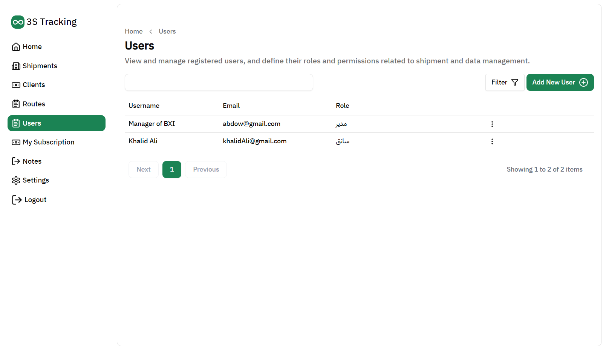
```

### My Subscription

Route:

```text
/{locale}/my-subscription
```

The subscription page shows the company subscription state:

- Plan type.
- Price.
- Start date.
- End date.
- Subscription status.
- Available plans.
- Plan change or renewal flow.
- Subscription FAQ.

Suggested screenshot:

```md
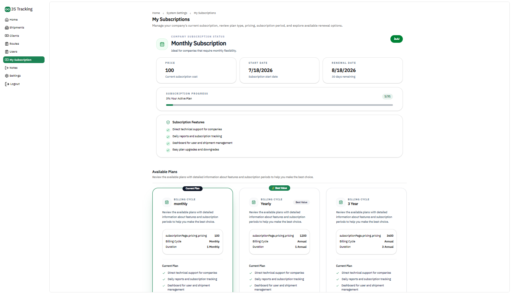
```

### Manager and Employee Notes

Route:

```text
/{locale}/notes
```

Managers and employees use this page to send feedback, complaints, questions, or requests to platform administration. They can:

- View notes.
- Add a note.
- Edit a note.
- Delete a note.
- Set the note type.

Suggested screenshot:

```md
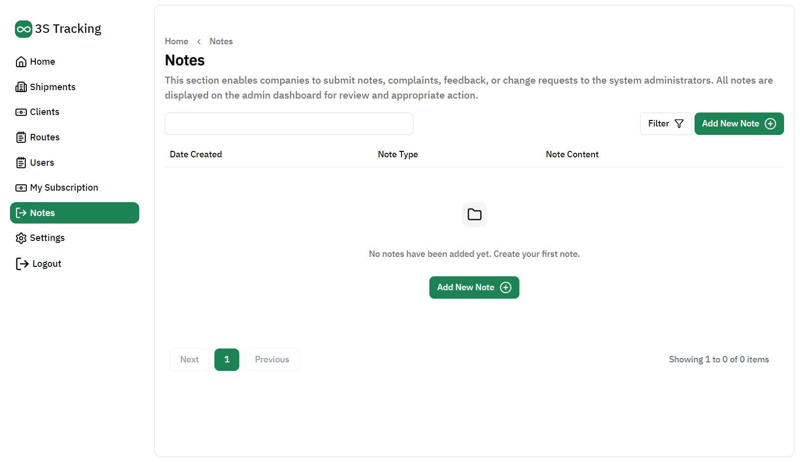
```

## Employee Dashboard

Employees use the operational part of the dashboard. They do not access subscription management or user management. The employee sidebar includes:

- Home
- Shipments
- Clients
- Routes
- Notes
- Settings

Employees share these pages with managers:

- Operational statistics.
- Shipments.
- Clients.
- Routes.
- Notes.
- Settings.

Suggested screenshot:

```md

```

## Public Client Shipment Tracking

Route:

```text
/{locale}/c/{clientId}/i/{shipmentId}
```

This page is designed for end customers. It does not expose the dashboard and is meant to be opened from a tracking link. It displays:

- Shipment number.
- Current shipment status.
- Origin and destination.
- Number of route points.
- Carrier company.
- Client information and contact methods.
- Trip progress percentage.
- Current point.
- Remaining points.
- Shipment timeline.
- Route map.
- Order details, shipment items, and driver information.

The page also listens for real-time updates so customers can see the latest shipment state.

Suggested screenshot:

```md
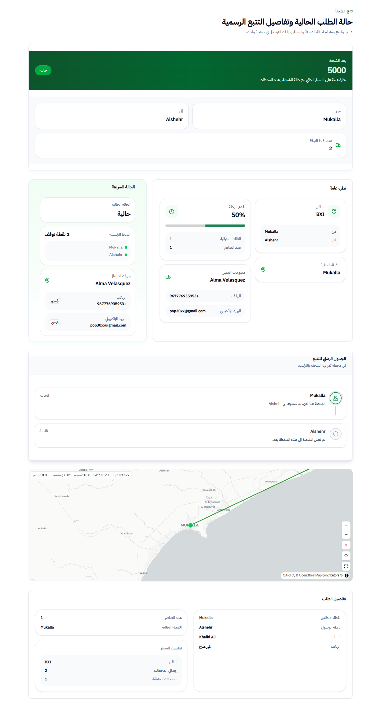
```

## Subscription Status Pages

### Pending Review

Route:

```text
/{locale}/pending
```

Displayed when a company subscription request is waiting for review. It explains the current state and expected next steps.

Suggested screenshot:

```md
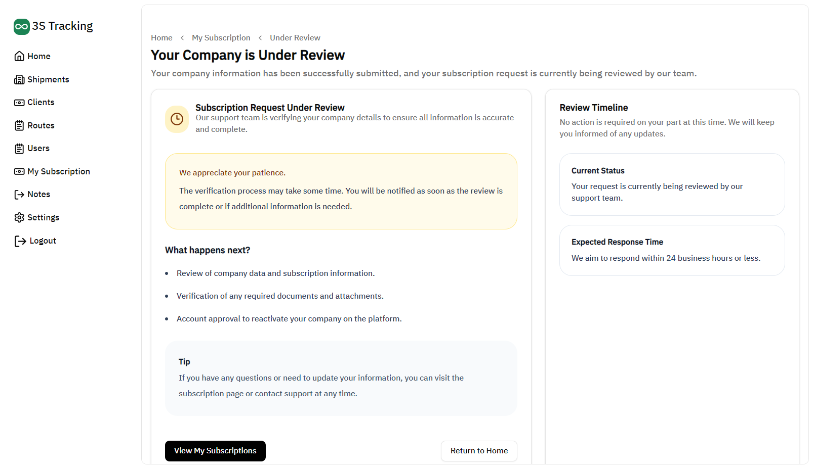
```

### Expired Subscription

Route:

```text
/{locale}/expire
```

Displayed when the company subscription has expired. It explains that access is locked until renewal and links back to the subscription page.

Suggested screenshot:

```md
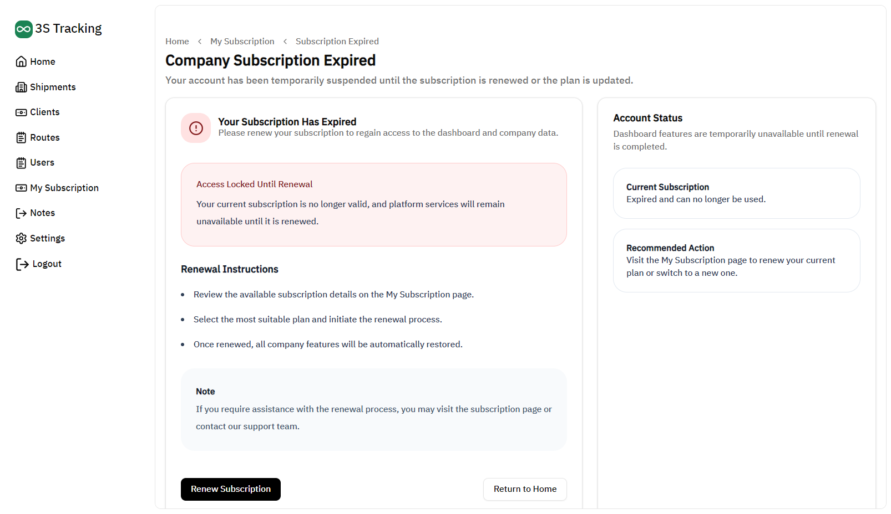
```

### Inactive Company

Route:

```text
/{locale}/in-active
```

Displayed when the company is inactive or paused. It explains likely reasons and the recommended next step.

Suggested screenshot:

```md
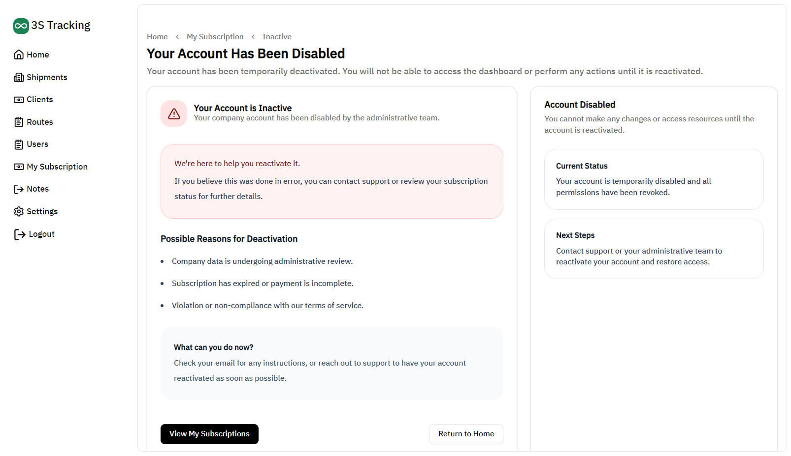
```

## Settings

Route:

```text
/{locale}/settings
```

The settings page is shared by admins, managers, and employees. It includes:

- Language selection.
- Account information.
- Company subscription status for non-admin users.

Admins do not see the subscription status section because subscriptions belong to companies.

Suggested screenshot:

```md
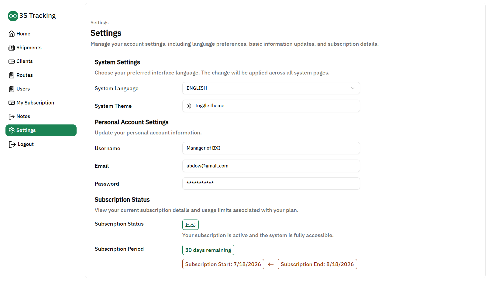
```

## Real-Time Updates

The app mounts `SocketProvider` in `app/[locale]/layout.tsx`, which opens a Socket.IO connection for real-time updates. Several pages include dedicated real-time listener components, including:

- Admin and manager statistics.
- Companies.
- Subscriptions.
- Subscription requests.
- Shipments.
- Clients.
- Routes.
- Users.
- Notes.
- Public client shipment tracking.

This keeps tables, cards, and tracking views up to date without requiring a manual page refresh.

## Existing Assets

Static assets are stored in:

```text
public/assets/
```

Examples:

- `public/assets/hero3-image.png`
- `public/assets/register-company.jpg`
- `public/assets/screenshot/home.png`
- `public/assets/screenshot/create-shipment.png`
- `public/assets/screenshot/shipment-details.png`
- `public/assets/mobile-home.png`
- `public/assets/mobile-shipment.png`
- `public/assets/mobile-shipment-details.png`

The README screenshot placeholders are intentionally placed under:

```text
public/assets/readme/
```

Add the screenshots there later using the filenames referenced in this README.

## Development Notes

- Do not rely on sidebar visibility alone for permissions. Route access is enforced in `proxy.tsx` and the middleware files.
- When adding a new locale, update `i18n/routing.ts` and the files under `messages/`.
- When adding a new dashboard page, update the sidebar, middleware rules, and translations.
- When adding a new API endpoint, prefer adding its route constant in `lib/Constant/routes.ts`.
- When adding real-time behavior, follow the existing `*-real-time` listener pattern used across the dashboard.

## Important Files

- `app/[locale]/layout.tsx`: Root providers, locale direction, theme, React Query, Socket.IO, and toasts.
- `proxy.tsx`: Route grouping and middleware dispatch.
- `components/sideBar/side-bar.tsx`: Role-based dashboard navigation.
- `lib/Constant/user-role.tsx`: Role definitions.
- `lib/Constant/routes.ts`: API route constants.
- `i18n/routing.ts`: Supported locales and default locale.
- `messages/ar.json`: Arabic translations.
- `components/landing/register-company-form.tsx`: Company subscription request form.
